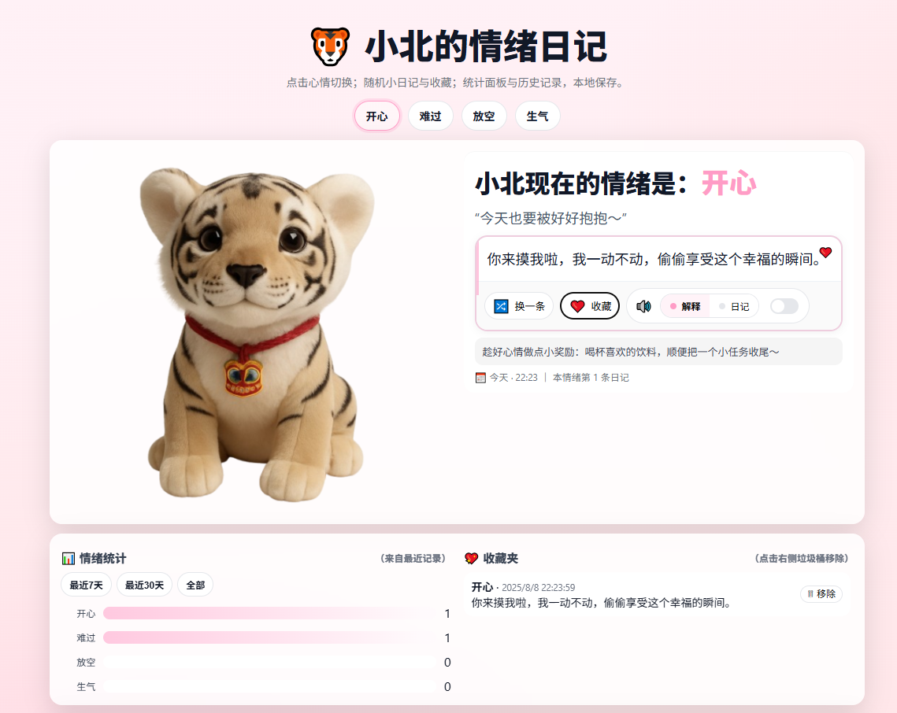

# xiaobei-emotion-diary
My baby tiger's emotion diary
# 🐯 小北的情绪日记

**版本**：v4.1  
一个可爱的情绪日记网页，你可以选择小北（小老虎）的心情，查看对应的小日记、语音播报、收藏和历史记录统计。支持桌面和移动端访问。

## 🌟 功能
- 四种情绪：开心、难过、放空、生气
- 每种情绪有多条可随机切换的小日记
- 支持情绪统计（7天 / 30天 / 全部）
- 本地收藏夹（保存喜欢的日记）
- 语音播报（可选播报情绪解释或小日记）
- 最近10次心情记录
- 本地保存数据（不上传服务器）

## 📷 预览

## 📱 在线试玩
👉 [点击进入小北的情绪日记](https://你的用户名.github.io/xiaobei-emotion-diary/)

## 🛠 本地运行
下载仓库，直接用浏览器打开 `index.html` 即可，无需安装任何依赖。

## 📝 License
暂无（仅个人/朋友使用）
